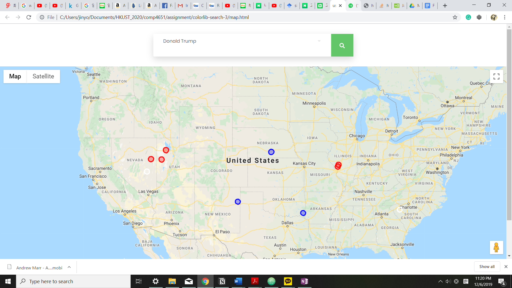
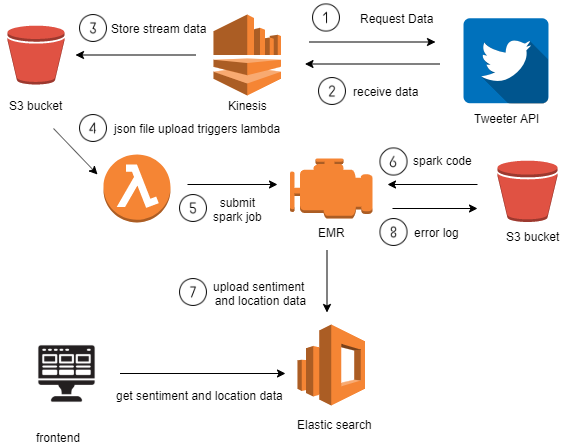
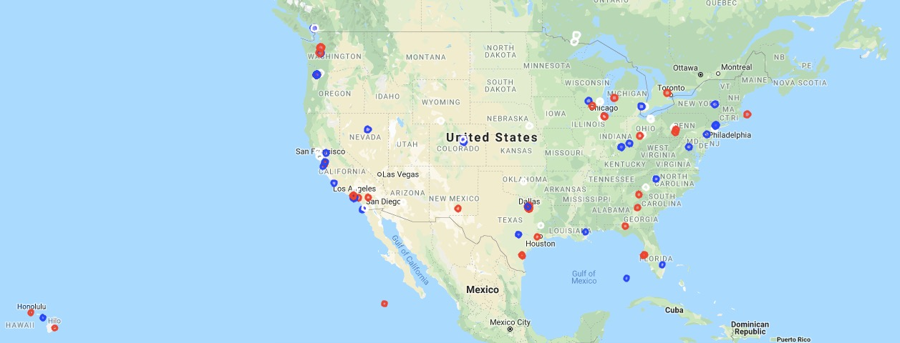

# tweetpoll-spark
This repository covers the backend section of Tweetpoll, a serverless web application for visualising real-time sentiments from tweets on running candidates of 2020 US presidential elections. 

## Architecture
The application utilises five AWS services: Firehose Stream, S3, Lambda, Elastic MapReduce and ElasticSearch. 

The Firehose Stream runs the code from `stream_tweets.py` on an EC2 instance in order to capture tweets from twitter data stream in real-time and apply specific filters to only collect tweets with the names of the presidential candidates. These tweets are stored in a S3 bucket with upto 1000 tweets in one .csv file. 

Every upload to the S3 bucket triggers Lambda runs  the handler function implemented in `submit_job.py`. The handler function takes the uploaded csv file and submits a Spark task to an EMR cluster (setup using `create_tweetpoll_emr.sh` and `emr_bootstrap.sh`). 

The Spark task implemented in `tweet_sentiment.py` is run on the given .csv file which involves determine the presidential candidate mentioned, the sentiment score and the geolocation for each tweet. These three data points about each tweet are then uploaded as a document indexed by the candidate's last name to the ElasticSearch instance. 

### About the Frontend 
The implementation for frontend involves two aspects: search and visualisation. The search function is used to query about the sentiment about a presidential candidate. Most recent datapoints about the candidate are fetched from the ElasticSearch. These datapoints are then visualised on the United States map using Google Map API. With adequate number of datapoints, the a rough estimate of the state polls for each candidate can be determined. 

